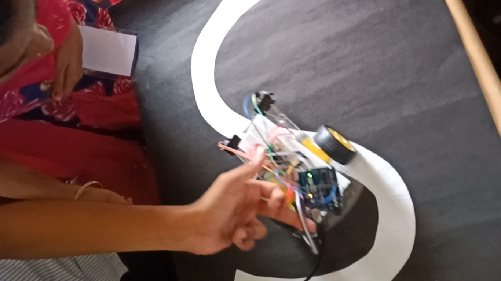

# line_follower_arduino

Arduino Uno : Arduino/Genuino Uno is a microcontroller board based on the ATmega328P (datasheet). It has 14 digital input/output pins (of which 6 can be used as PWM outputs), 6 analog inputs, a 16 MHz quartz crystal, a USB connection, a power jack, an ICSP header and a reset button. It contains everything needed to support the microcontroller; simply connect it to a computer with a USB cable or power it with a AC-to-DC adapter or battery to get started.. You can tinker with your UNO without worring too much about doing something wrong, worst case scenario you can replace the chip for a few dollars and start over again.

In this project bot follow the white line within the blackline without human interacion. It'll use ir sensor properties to detect whenther the line bot travelling is white or black. Based on that it'll take decision as we mention in code.

You can check project images here

